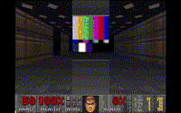

# giffy

Create vanilla-compatible animated displays from an animated GIF.



Originally seen in [TRUCK.WAD](https://www.doomworld.com/idgames/levels/doom2/deathmatch/s-u/truck).

# Warnings

**Creating vanilla-compatible animated displays is effort intensive.**

Make sure you actually want to do this as it will require some investment of time on your part.

The **WIDTH** of your display will be the most troublesome part. Narrow displays (&le;32px) will be the easiest to work with, but you can create any size within the limits.

**Strict vanilla** has a limit of 64 scrolling linedefs, which means your display must be &le;64px wide, and you must not have any other scrolling walls in your map. This is not an issue for most ports and is of course no problem for "limit-removing vanilla."

# Pre-requisites

* Python3
* Tkinter
* Pillow


* *Optional:* [omgifol](https://github.com/devinacker/omgifol) for map generator script

# Instructions

1. Choose an animated GIF.
    * No more than 1024 frames.
    * No more than 1024px height per frame.
        * NOTE: More than 128px height per frame will **NOT** work in strict vanilla
    * Only animations with power-of-2 frames will loop smoothly.
2. Run the program, select your animated GIF.
    * **Important**: Write down the instructions you receive at the output prompt!
3. Import each generated PNG as a Texture in your WAD and follow the instructions you were given at the output prompt.
    * **Note**: You can optionally use the included `mappy.py` to generate the display for you.

# Tips

## Creating the display

A helper script, `mappy.py` is included to generate the display for you.

Requirements: [omgifol](https://github.com/devinacker/omgifol)

Run the script and it will generate `template.wad` with your display assembled, including line offsets. You can copy and paste it into your WAD as you like.


## Resizing animated GIFs

Try [ImageMagick](https://imagemagick.org/index.php) for resizing animated GIFs.

Example:

Resize to 32x32 but keep aspect ratio intact:

```
mogrify -resize '32x32' mygif.gif
```

Or to force the size to be 32x32:

```
mogrify -resize '32x32!' mygif.gif
```

## Converting video to animated GIF

Try [ffmpeg](https://ffmpeg.org/) for converting video to animated GIF format.

Example:

```
ffmpeg -i my_video.mp4 my_video.gif
```

Or for reduced size:

```
ffmpeg -i my_video.mp4 -vf 'fps=fps=35,scale=200:-1' my_video.gif
```

